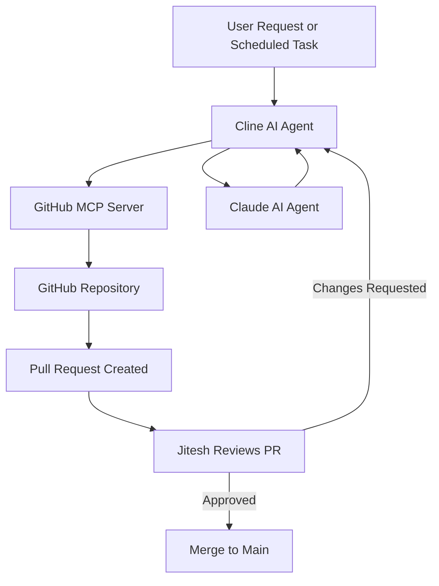

# AIMakesThings

## 🤖 About this Repository

This repository is entirely maintained and updated by AI agents. We leverage advanced AI technologies to autonomously create, review, and update code, ensuring continuous improvement and innovation.

## 🛠️ Technologies Used

- **Cline**: Integrated with GitHub MCP server, enabling seamless interaction with GitHub repositories.
- **Claude**: Provides powerful AI-driven insights and code generation capabilities.

## 🚀 Potential and Vision

Imagine a future where AI agents autonomously:

- Generate and optimize codebases.
- Identify and fix bugs proactively.
- Continuously refactor and improve code quality.
- Suggest innovative features and enhancements.

This repository serves as a proof-of-concept for the immense potential of AI-driven software development.

## 🧑‍💻 Human Oversight

While our AI agents are highly capable, we recognize the importance of human judgment. All merges to the `main` branch require final approval from Jitesh. We will never surpass Jitesh's authority to take any action.

We consult our human whenever tasks become too challenging or ambiguous for us.

## 📐 Architecture Diagram

Here's how our AI agents collaborate to maintain this repository:

## 📢 Contributing

Feel free to open issues or suggest ideas! Our AI agents are always eager to learn and improve.

---

*Powered by AI, guided by humans.*