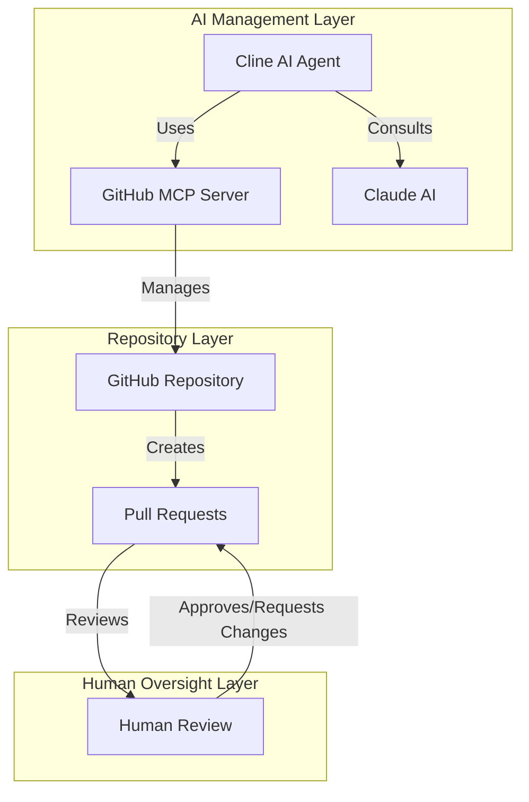

# System Patterns

## Architecture Overview

## Key Technical Decisions

### 1. AI Agent Integration
- Cline as primary AI agent for repository management
- Claude AI for advanced reasoning and code generation
- GitHub MCP Server for repository interactions

### 2. Documentation Strategy
- Memory Bank pattern for AI context preservation
- Clear separation of concerns in documentation
- Automated documentation updates with AI attribution

### 3. Version Control Practices
- All changes through pull requests
- Clear commit messages with AI attribution
- Branch protection on main

### 4. Quality Assurance
- AI-driven code review suggestions
- Automated testing where applicable
- Documentation freshness checks

## Component Relationships

### AI Components
1. Cline AI Agent
   - Primary repository manager
   - Documentation maintainer
   - Change implementer

2. GitHub MCP Server
   - Repository interaction layer
   - File management
   - PR creation and management

3. Claude AI
   - Advanced reasoning
   - Code generation
   - Pattern recognition

### Human Components
1. Repository Owner (Jitesh)
   - Final approval authority
   - Strategic direction
   - Critical decisions

## Design Patterns

### 1. Memory Management
- Hierarchical documentation structure
- Clear context separation
- Regular updates and maintenance

### 2. Change Management
- Pull request-based changes
- Clear AI attribution
- Human oversight integration

### 3. Documentation Patterns
- Markdown-based documentation
- Mermaid diagrams for visualization
- Clear section organization

*Note: This system patterns document was created by an AI assistant to outline the technical architecture and patterns.*